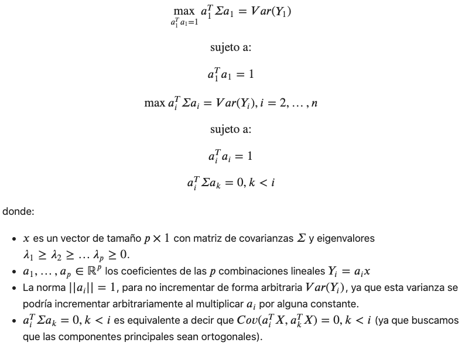

layout: true
background-position: 98% 5% 
background-size: 12%
<div style="text-align: justify">  
---

```{r logo, echo=F}
#devtools::install_github("gadenbuie/xaringanExtra")
library(xaringanExtra)

xaringanExtra::use_logo(
  image_url = "http://escolar.itam.mx/centro_tesis/img/logo-ITAM.png",
  position = xaringanExtra::css_position(top = "1em", right = "1em")
)
```

# Índice

###1. Introducción

###2. PCA

###3. EigenFaces
  - Algoritmo con SVD
  - Algoritmo con Rotaciones de Jacobi
  
###4. Conclusiones

---

# Introducción

Dos tendencias principales en los algoritmos para reconocer rostros:

- Algoritmos basados en la apariencia (holísticos)
- Algoritmos basados en rasgos (features).

**Los algoritmos de clasificación más utilizados para resolver el problema del reconocimiento de rostro han sido PCA y LDA.**

Eigenfaces y Fisherfaces son ejemplos de estos; también se han utilizado métodos bayesianos, entre otros.


```{r, echo = F, eval=T, out.width="60%", fig.align='center'}

```

---

class: inverse, center, middle

# Análisis de Componentes Principales

---

# Planteamiento del Problema

El **Análisis de Componentes Principales** (PCA) se utiliza usualmente como una técnica de visualización, reducción de dimensión y también como un paso intermedio en el análisis de datos como técnica explicatoria. Es por ello que **este método es uno de los usos principales de la SVD**.

Representa la selección de un nuevo conjunto de coordenadas, que obtenemos mediante rotación y traslación del sistema original a ejes, en donde se maximiza la varianza en cada dirección.

```{r, echo = F, eval=T, out.width="40%", fig.align='center'}
knitr::include_graphics("img_2.png")
```

---

### El Problema de Optimización

```{r, echo = F, eval=T, out.width="90%", fig.align='center'}

```

---

# Implementación

**Pasos**

1. Estandarización de variables.
2. Selección del número de componentes principales según el porcentaje de varianza explicada.
3. Utilizar el algoritmo de PCA, que podemos consultar en la documentación de sklearn.
4. Interpretar las componentes principales.


**Elección de las Componentes Principales**

- QCP que acumulen cierto porcentaje de la variación total.
- CP cuyos eigenvalores sean mayores que el promedio $\bar{\lambda}$.
- Utilizar una gráfica de codo (scree plot).
- Verificar la significancia de las componentes más grandes.

---

# Ventajas y Desventajas de PCA

**Ventajas**
- Reducción de variables correlacionadas entre sí.
- Mejora el desempeño del algoritmo.
- Reduce el sobreajuste.
- Puede proveer una mejor visualización.


**Desventajas**
- Las componentes principales pueden ser sensibles a outliers.
- Las componentes principales son sensibles a distintos escalamientos de los datos originales.
- Difícil interpretación de las componentes principales y de las visualizaciones.
- Puede haber una pérdida significativa de información.

---
class: inverse, center, middle

# EigenFaces
Aplicando SVD

---

# Descripción del Algoritmo

```{r, echo = F, eval=T, out.width="120%", fig.align='center'}
knitr::include_graphics("img_4.png")
```
---

# Implementación del Algoritmo

```{r, echo = F, eval=T, out.width="60%", fig.align='center'}
knitr::include_graphics("img_5.png")
```
---

# Implementación del Algoritmo
```{r, echo = F, eval=T, out.width="60%", fig.align='center'}

```
---

# Implementación del Algoritmo

```{r, echo = F, eval=T, out.width="50%", fig.align='center'}
knitr::include_graphics("img_7.png")
```

---

# Implementación del Algoritmo

```{r, echo = F, eval=T, out.width="80%", fig.align='center'}
knitr::include_graphics("img_8.png")
```

```{r, echo = F, eval=T, out.width="80%", fig.align='center'}
knitr::include_graphics("img_9.png")
```

---

# Implementación del Algoritmo

```{r, echo = F, eval=T, out.width="50%", fig.align='center'}

```

---

# Implementación del Algoritmo

```{r, echo = F, eval=T, out.width="90%", fig.align='center'}

```
---

# Implementación del Algoritmo

```{r, echo = F, eval=T, out.width="100%", fig.align='center'}
knitr::include_graphics("img_12.png")
```
---

# Implementación del Algoritmo

```{r, echo = F, eval=T, out.width="70%", fig.align='center'}

```
---
class: inverse, center, middle

# EigenFaces
Aplicando Rotaciones de Jacobi

---

# Descripción del Algoritmo

El **método de rotaciones Jacobi one sided, es un método numérico para calcular SVD**. El método utiliza las rotaciones de Jacobi, una transformación de rotación, para construir a la matriz ortogonal V y llegar a W.

En este apartado, hacemos uso de este método, que construimos en una práctica anterior, como una forma de llegar a la descomposición SVD e implementar el algoritmo Eigenfaces.


---

# Implementación del Algoritmo

```{r, echo = F, eval=T, out.width="50%", fig.align='center'}

```

---

# Implementación del Algoritmo

```{r, echo = F, eval=T, out.width="50%", fig.align='center'}
knitr::include_graphics("img_15.png")
```

---

# Implementación del Algoritmo

```{r, echo = F, eval=T, out.width="100%", fig.align='center'}
knitr::include_graphics("img_16.png")
```

---
class: inverse, center, middle

# Conclusiones
Aplicaciones y enfoques alternativos

---

# Conclusiones y Aplicaciones

Uno de los principales desafíos en el reconocimiento de rostros viene dado por las **variaciones dadas en posición (perspectiva), gestualidad e iluminación de las caras**.


Dos enfoques alternativos:

- Fisher Faces
- Tensor SVD


---

layout: false
class: inverse, center, middle

# Dudas


